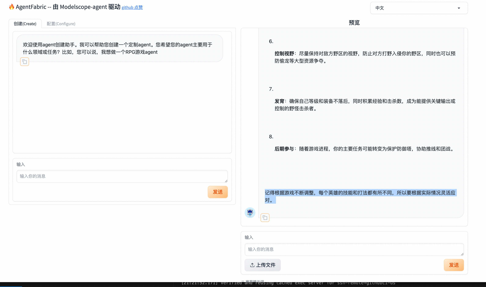

## modelscope agent 无外网环境部署

### 环境准备
准备好一个工作目录`/data/work`，在这个目录下进行后续操作.
#### 拉取镜像
拉取modelscope-agent镜像，镜像中已经安装好所需依赖。
```shell
sudo docker pull registry.cn-hangzhou.aliyuncs.com/modelscope-repo/modelscope-agent:v0.3.0
```
#### 拉起容器
```shell
sudo nvidia-docker run -ti --net host -v /data/work:/data/work registry.cn-hangzhou.aliyuncs.com/modelscope/modelscope-agent:v0.3.0 bash
```
其中`-v /data/work:/data/work`把`/data/work`目录挂载到容器中。执行命令此命令后已进入容器，后续操作都将在容器中进行。此时进到工作环境目录。
```shell
cd /data/work
```

### llm部署
modelscope提供模型[本地启动服务](https://modelscope.cn/docs/%E6%9C%AC%E5%9C%B0%E5%90%AF%E5%8A%A8%E6%9C%8D%E5%8A%A1)功能。这里我们使用该功能，将模型部署成openai api兼容的接口。具体操作可参考如下：

#### 下载模型
下载模型到本地：以qwen/Qwen1.5-7B-Chat模型为例，可以换成其他微调的模型
```shell
python -c "from modelscope import snapshot_download; snapshot_download('qwen/Qwen1.5-7B-Chat', cache_dir='qwen1.5-7b-chat')
```
#### 部署模型
```shell
MODELSCOPE_CACHE='qwen1.5-7b-chat' python -m vllm.entrypoints.openai.api_server \
    --model qwen/Qwen1.5-7B-Chat --dtype=half --max-model-len 8192  --gpu-memory-utilization 0.95 &
```
#### 测试部署
测试模型服务，如果正确返回，说明模型服务部署完成。
```shell
curl http://localhost:8000/v1/chat/completions \
    -H "Content-Type: application/json" \
    -d '{
        "model": "qwen/Qwen1.5-7B-Chat",
        "messages": [
            {"role": "system", "content": "You are a helpful assistant."},
            {"role": "user", "content": "写一篇春天为主题的作文"}
        ],
        "stop": ["<|im_end|>", "<|endoftext|>"]
    }'
```

### 部署agent
另起一个终端窗口，登录到上面拉起的docker容器中
```shell
# 查看之前容器ID
sudo docker ps -a
# 进入对应容器ID的容器
sudo docker exec -ti CONTAINER_ID bash
```
在容器中进行后续操作

#### 下载代码
拉取modelscope-agent最新master代码 (当前修复代码在[PR](https://github.com/modelscope/modelscope-agent/pull/301)中， 分支feat/qwen_vllm)
```shell
git clone https://github.com/modelscope/modelscope-agent.git
cd modelscope-agent/
git checkout -b qwen_vllm origin/feat/qwen_vllm
```

#### 拉起agent gradio
```shell
cd modelscope-agent/apps/agentfabric
```
编辑config/model_config.json， 增加如下配置
```
    "qwen1.5-7b-chat": {
        "type": "openai",
        "model": "qwen/Qwen1.5-7B-Chat",
        "api_base": "http://localhost:8000/v1",
        "is_chat": true,
        "is_function_call": false
    }
```
在`agentfabric`目录下执行如下命令拉起gradio
```shell
GRADIO_SERVER_NAME=0.0.0.0 PYTHONPATH=../../  python app.py
```
然后在浏览器中输入你 服务器IP:7860打开即可看到如下界面。
